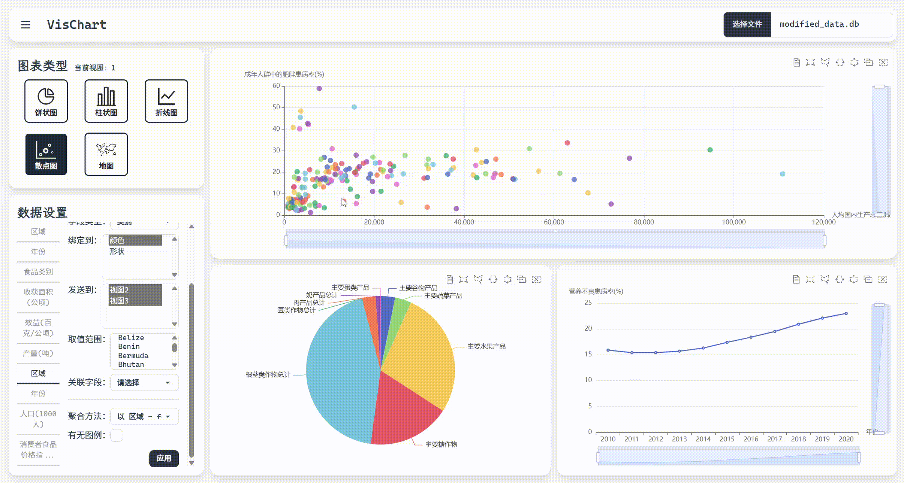
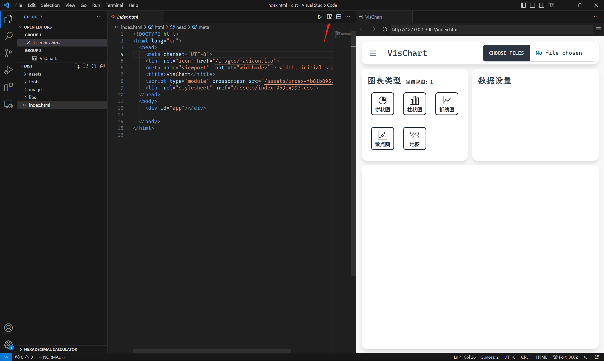

# VisChart
VisChart 是一个基于 web 前端开发的可视化分析系统，支持上传 SQLite 数据库文件，通过简单的设置即可实现对数据的快速可视化。


## 效果展示



## 配置运行
### 开发版本
本项目使用 vue3 + tailwindcss + daisyUI + echarts 开发，如要开发本项目，请先下载 Node.js，然后在此文件夹下依次运行以下命令：
```bash
npm install -D tailwindcss
npm i -D daisyui@latest
npm install echarts
```

如果你已在 vscode 安装了 vite 插件，那么此时用 vscode 打开本项目文件夹，就能在内嵌浏览器中看到自动打开的网页了，如果不想使用 vscode，那也可以在命令行输入：
```bash
npm run dev
```
或
```bash
npm run preview
```


### 构建版本
如果只是想要使用本项目，那么 `dist` 文件夹中已经存放了本项目的构建版本，无需配置环境即可使用。不过这需要先在本地启动 http 服务器，这里推荐两种方法：
- 先使用 `npm install http-server -g` 下载 `http-server`，然后在 `dist` 文件夹下运行 `http-server . -p 8888 -o`，网页就会自动在默认浏览器打开（或者换个没被占用的端口）
- 在 vscode 中安装微软官方插件 live preview，然后用 vscode 打开 `dist` 文件夹，再打开其中的 `index.html` 文件，点击右上角的 Show Preview，就可以在 vscode 的内嵌浏览器查看网页了




## 使用说明
上方导航栏左侧的按钮可以切换视图布局、隐藏/显示侧边栏、关闭/打开视图提醒。

点击不同的视图标签页，会切换到不同的视图，图表类型标签页和数据设置标签页的内容也会相应改变。

上传数据库文件后，网页会自动读取其中的所有表和所有字段，并在数据设置的左侧边栏列出，选中其中的字段，会依次在右侧显示以下信息和设置：
- 字段设置
  - 来自表：显示该字段所在的表的名称
  - 字段名称：显示该字段的完整名称
  - 字段类型：可以选择是 category (类别) 还是 value (值)
  - 绑定到：选择绑定到的图表的维度，不同图表类型、不同类型的字段可绑定的维度都不同，如散点图可以绑定横轴、纵轴、颜色、形状、大小、颜色渐变，其中颜色和形状只有类型为 category 的字段可以绑定
  - 发送到：视图数量大于一时出现，当且仅当当前图表只有一个 category 类型的维度被绑定时生效，可以在鼠标悬浮时，将悬浮地区该 category 类型的字段的值发送给其他视图的相同字段，若设置了关联字段，则还会同时发送给与该字段关联的其他字段
  - 关联字段：选择此字段与其他表的哪个字段相等，如表一的区域等于表二的区域
- 图表设置
  - 聚合方法：以某个类型为 category 的字段为单位，将可能的无法区分的多条数据以取总和或取平均值的方式聚合起来。比如将销量绑定到横轴，利润率绑定到纵轴，并选择以地区为单位取平均值，然后就可以将每个地区多年的数据取平均值，变为图上的一个点，但是此时若将年份绑定到颜色渐变上，就会无法聚合，因为此时可以靠年份区分各条数据
  - 有无图例：选择是否展示图例

最后点击应用，即可获得设置的可视化效果
